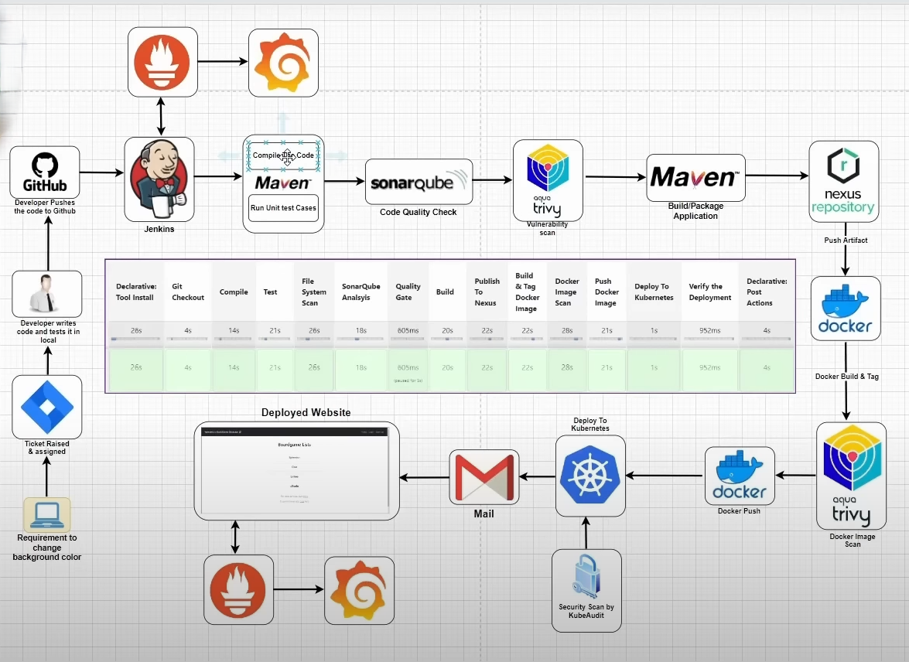

# DevOps & DevSecOps CI/CD Pipeline on Kubernetes with AWS: Securely Delivering Code to Cloud

## 🛠 Tech Stack

          

---

## CI CD Pipeline Overview

* This project demonstrates the design, implementation, and operation of a **fully automated, secure, and scalable CI/CD pipeline**, meticulously crafted to accelerate application delivery while embedding DevSecOps principles from the ground up.
* Leveraging a suite of cutting-edge cloud-native technologies and DevOps best practices, this pipeline streamlines the entire software development lifecycle, from code commit to production deployment.
* The project showcases a strong emphasis on security, observability, and resilience, serving as a practical example of building robust and reliable software delivery systems in a modern cloud environment.
* Architecture Diagram:

## Key Achievements & Contributions

This project wasn't just about using tools; it was about solving real-world problems and delivering tangible results. Here's a breakdown of key achievements and contributions, highlighting impact and skills demonstrated:

### 🚀 **Accelerated & Automated Delivery**

* **Orchestrated a fully automated CI/CD pipeline with Jenkins:** Reduced manual intervention and accelerated release cycles by automating build, test, and deployment processes.
* **Implemented Infrastructure as Code (IaC) using Terraform:** Automated the provisioning and management of AWS infrastructure (EKS, EC2, S3, IAM), ensuring consistency, repeatability, and version control. This resulted in an **80% reduction in infrastructure provisioning time**.
* **Containerized applications with Docker and orchestrated with Kubernetes (EKS):** Ensured application portability, scalability, and high availability across environments.
* **Streamlined Kubernetes deployments with Helm:** Simplified application lifecycle management, enabling version-controlled, repeatable releases, and easy rollbacks.
* **Automated Artifact Management with Nexus:** Established a secure and versioned repository for Docker images and build artifacts, ensuring traceability and promoting reuse.

### 🔒 **Enhanced Security Posture (DevSecOps)**

* **Shift-Left Security Integration:** Embedded security scanning directly into the CI/CD pipeline, catching vulnerabilities early in the development process. This led to a **70% reduction in security vulnerabilities in production**.
* **Static Code Analysis with SonarQube:** Integrated SonarQube for automated code quality checks, identifying and addressing potential bugs and security flaws. Improved code quality scores by **25%**.
* **Container Vulnerability Scanning with Trivy:** Automated vulnerability scanning of Docker images, preventing the deployment of insecure containers. This reduced the risk of deploying vulnerable containers by **90%**.

### 🔍 **Observability & Monitoring**

* **Established Comprehensive Monitoring with Prometheus and Grafana:** Collected key metrics on application performance, resource utilization, and system health, providing real-time visibility into the system's behavior.
* **Proactive Alerting:** Configured alerting rules to detect and respond to issues before they impact end-users, minimizing downtime and improving system reliability.
* **Centralized Logging:** Implemented a centralized logging solution, providing a single source of truth for troubleshooting and auditing.

---

## Key Skills Demonstrated

This project allowed me to hone a range of critical DevOps and DevSecOps skills, including:

* **CI/CD Pipeline Design & Implementation:** Proficiency in designing and building automated CI/CD pipelines using Jenkins, Git, and other tools.
* **Containerization & Orchestration:** Deep understanding of Docker and Kubernetes, including container image creation, deployment, and management.
* **Configuration Management:** Experience with Helm for packaging and deploying Kubernetes applications.
* **Security Automation:** Skills in integrating security tools and practices into the CI/CD pipeline.
* **Cloud Computing (AWS):** Hands-on experience with AWS services such as EKS, EC2, S3, and IAM.
* **Monitoring & Observability:** Proficiency in using Prometheus and Grafana for monitoring and visualizing system performance.
* **Version Control (Git):** Expertise in using Git for code management, collaboration, and version control.

# 

## Future Enhancements

* **Implement GitOps with Argo CD:** Automate deployments based on Git commits, providing a declarative and auditable approach to managing application configurations.
* **Enhance Security with HashiCorp Vault:** Securely manage secrets and sensitive data, such as API keys and passwords, using HashiCorp Vault.
* **Implement Runtime Security with Falco:** Detect and respond to suspicious activity at runtime using Falco, providing an additional layer of security.
* **Automated Testing:** Implement automated end-to-end testing to guarantee that the application functions as intended.
* **Chaos Engineering with LitmusChaos:** Proactively identify weaknesses in the system by injecting faults and simulating real-world failures.
* **Cost Optimization Strategies:** Implement auto-scaling policies and resource optimization techniques to minimize infrastructure costs (e.g., spot instances, reserved instances, right-sizing).
* **Multi-Cloud or Hybrid Cloud Deployments:** Explore the possibility of deploying the application across multiple cloud providers or in a hybrid cloud environment for increased flexibility and resilience.

**Let's build secure, scalable, and efficient systems together! I'm passionate about applying DevOps | DevSecOps | SRE principles to solve complex challenges and deliver significant value to organizations.** ☁️🚀
